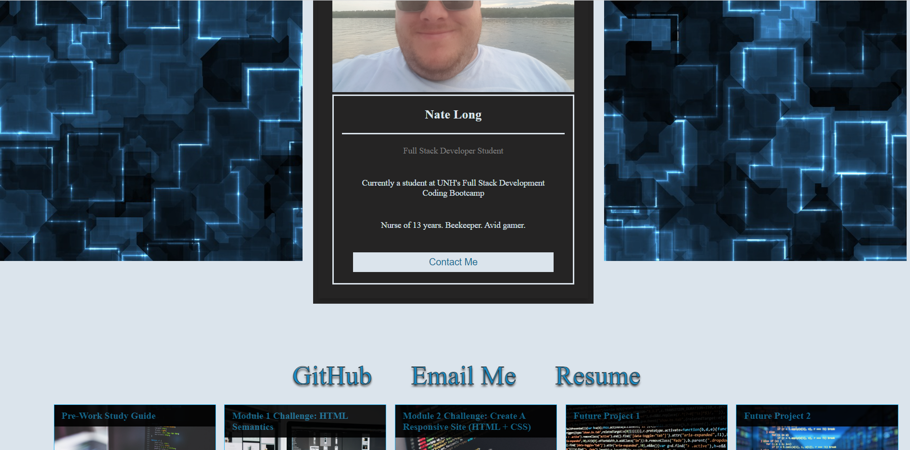

# <Module 2 Challenge: Portfolio>

## Description

This project was done to demonstrate skills learned to design and build a responsive website that can be viewed fully in any resolution. In the future, this project can be updated to showcase the student developers work and projects completed to help demonstrate to future employers capability and current level of skill.

## Installation

None required.

## Usage

The below picture is what the website will look like on a desktop monitor. Change the resolution to see the website's responsiveness.

## Credits

How to create a professional README: https://coding-boot-camp.github.io/full-stack/github/professional-readme-guide
HTML Semantic Elements: https://www.w3schools.com/html/html5_semantic_elements.asp
w3schools - HTML Responsive Design: https://www.w3schools.com/html/html_responsive.asp

And as always, this couldn't have been completed with out the help from fellow classmates!

## License

See license in repo